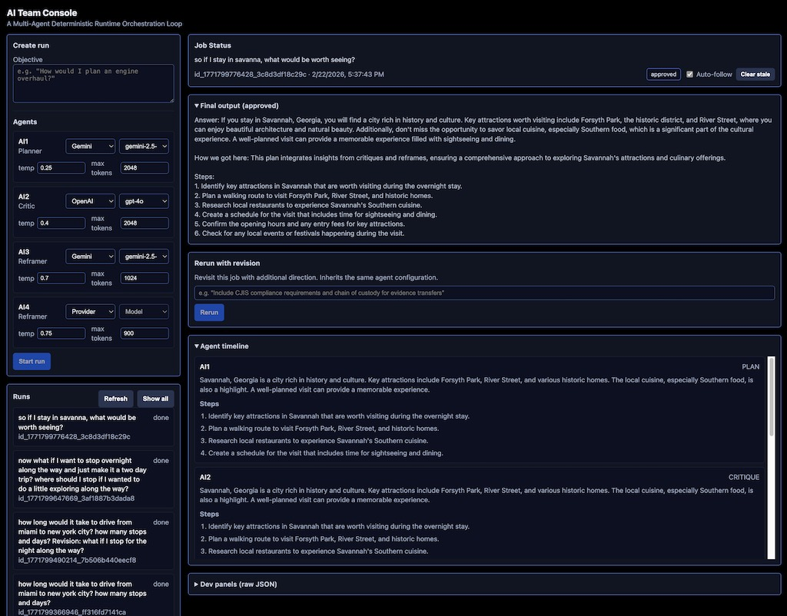

## AI Team
   **A Multi-Agent Orchestration Runtime**
 
AI Team is a committee-based AI orchestration system where multiple AI agents — each with a distinct role — deliberate on a problem 
through a deterministic pipeline. No agent acts alone. Every output passes through critique, reframing, revision, validation, and a human commit gate before it ships.


The human is always in the loop. The pipeline is deterministic. The order matters.

---

## How It Works

AI Team runs four agent lanes through a fixed pipeline:

```
User Objective
  │
  ▼
┌──────────┐
│  AI1     │  PLANNER — Produces a structured plan with claims,
│          │  steps, assumptions, and evidence requirements.
└────┬─────┘
     │
     ▼
┌──────────┐
│  AI2     │  CRITIC — Evaluates the plan. Identifies risks,
│          │  gaps, unverified assumptions, and missing steps.
└────┬─────┘
     │
     ▼
┌──────────┐
│  AI3     │  REFRAMER — Offers alternative perspectives.
│          │  Challenges assumptions from a different angle.
└────┬─────┘
     │
     ▼
┌──────────┐
│  AI4     │  REFRAMER — Second independent reframe.
│          │  Different provider, different creative temperature.
└────┬─────┘
     │
     ▼
┌──────────┐
│  AI1     │  REVISION — Integrates critique + reframes into a
│          │  bounded, deterministic final plan.
└────┬─────┘
     │
     ▼
┌──────────┐
│ Validator│  Checks structural integrity of the output.
│          │  PASS or FAIL. No negotiation.
└────┬─────┘
     │
     ▼
┌──────────┐
│  AI2     │  CONFIRM — Deterministic check. If validator passed,
│          │  recommends proceeding to human commit.
└────┬─────┘
     │
     ▼
┌──────────┐
│ Consensus│  Builds the proposed output from all agent outputs.
│ Builder  │  Assembles the commit gate package.
└────┬─────┘
     │
     ▼
┌──────────────────────────────────────────┐
│  HUMAN COMMIT GATE                       │
│                                          │
│  The human reviews the proposed output   │
│  and decides:                            │
│                                          │
│  ✅ Approve — Accept and commit          │
│  ❌ Reject  — Discard                    │
│  🔄 Revise  — Send back with new         │
│              direction (inherits config) │
└──────────────────────────────────────────┘
```

### Key Design Decisions

- **Any model can fill any role.** Providers and models are selected per-lane at runtime. Mix OpenAI, Anthropic, Google, and Azure in a single committee.
- **Lanes are conditional.** Leave a lane unconfigured and it's skipped. Run a 2-agent committee or a 4-agent committee — the pipeline adapts.
- **Revision carries full context.** Rerun a completed job with additional direction and the new committee receives the prior output, all revision notes, and the original objective. Nothing is lost.
- **The human commit gate is a first-class architectural element.** It's not a feature bolted on. Nothing executes, nothing ships, nothing is final without explicit human approval.

---

## Supported Providers

| Provider | Config Key | Models |
|----------|-----------|--------|
| **OpenAI** | `openai` | gpt-5.2-thinking, gpt-5.2, gpt-4o, gpt-4o-mini |
| **Anthropic** | `anthropic` | claude-sonnet-4-5-20250929, claude-haiku-4-5-20251001 |
| **Google Gemini** | `gemini` | gemini-2.5-flash, gemini-2.5-pro |
| **Azure OpenAI** | `azure_openai` | (uses deployment names) |

Adding a new provider requires one adapter file in `src/runtime/model/` and one entry in the dispatch switch.

---

## Project Structure

```
ai_team_public/
├── src/
│   ├── runtime/
│   │   ├── orchestrator.ts   # Pipeline execution — fixed agent order
│   │   ├── consensus.ts      # Builds proposed output from all agents
│   │   ├── commit.ts         # Human commit gate (pending/resolve)
│   │   ├── workspace.ts      # Workspace state management
│   │   ├── validator/        # Output validation (PASS/FAIL)
│   │   ├── types.ts          # Core types, Zod schemas
│   │   ├── agents/
│   │   │   ├── AI1.ts        # Planner + Revision
│   │   │   ├── AI2.ts        # Critic + Confirm
│   │   │   ├── AI3.ts        # Reframer
│   │   │   └── AI4.ts        # Reframer (independent)
│   │   └── model/
│   │       ├── dispatch.ts   # Routes providers to adapters
│   │       ├── openai.ts     # OpenAI adapter (text + JSON)
│   │       ├── anthropic.ts  # Anthropic adapter (text + JSON)
│   │       ├── gemini.ts     # Gemini adapter (text + JSON)
│   │       └── azure_openai.ts # Azure OpenAI adapter (text + JSON)
│   └── server/
│       ├── api.ts            # Express API — runs, commits, SSE, clear stale
│       └── runStore.ts       # File-based run persistence + status tracking
├── web/src/
│   ├── App.tsx               # Main layout — left panel + right panel
│   ├── api.ts                # Frontend API client
│   ├── styles.css            # Dark theme styles
│   └── components/
│       ├── CreateRun.tsx      # Objective + lane configuration UI
│       ├── RunList.tsx        # Run list with auto-polling
│       ├── RunView.tsx        # Job status, timeline, commit gate, rerun
│       └── JsonPanel.tsx      # Dev panel for raw trace/pending JSON
├── logs/runs/                 # Persisted run traces (JSON)
├── package.json
└── tsconfig.json
```

---
 

## Getting Started

### Prerequisites

- Node.js 18+
- TypeScript 5.3+
- At least one provider API key

### Install

```bash
cd ai_team_public
npm install
cd web && npm install && cd ..
```

### Configure

Create a `.env` file in the project root:

```env
# Required: at least one provider
OPENAI_API_KEY=sk-...

# Optional: additional providers
ANTHROPIC_API_KEY=sk-ant-...
GOOGLE_API_KEY=AI...
AZURE_OPENAI_API_KEY=...
AZURE_OPENAI_BASE_URL=https://your-resource.openai.azure.com/openai/v1
```

### Build

```bash
# Build backend (src/ → dist/)
npm run build

# Build frontend (web/src/ → web/dist/)
cd web && npm run build && cd ..
```

**Important:** The API server runs from `dist/`, not `src/`. Always rebuild after editing source files.

### Run

```bash
# Start the API server (serves both API and web UI)
npm start
```

Open `http://localhost:3001` in your browser.

---

## Usage

### Creating a Run

1. Enter an objective in the text field
2. Configure each lane — select provider and model from the dropdowns
3. Temperature and max tokens are pre-populated with role-appropriate defaults:
   - AI1 (Planner): 0.2 temp / 4096 tokens — structured, deterministic
   - AI2 (Critic): 0.2 temp / 1200 tokens — precise, analytical
   - AI3 (Reframer): 0.7 temp / 900 tokens — creative, divergent
   - AI4 (Reframer): 0.75 temp / 900 tokens — creative, divergent
4. Leave a lane's provider/model blank to skip it
5. Click **Submit**

### Reviewing Output

The Job Status panel shows:
- The objective at full width
- Run ID and timestamp on one line
- Unified status badge: `running` | `stale` | `awaiting commit` | `approved` | `done` | `failed`

The Agent Timeline shows each agent's output in execution order — notes, steps, claims, and assumptions.

### Commit Gate

When the pipeline completes and validates, the commit gate appears:
- **Approve** — Accept the proposed output
- **Reject** — Discard
- **Revise** — Enter a new objective; the system creates a new run inheriting the same lane configuration and carrying the prior output as context

### Rerun with Revision

After approving a job, the "Rerun with revision" section appears. Enter additional direction and the system:
- Preserves the original objective
- Carries the prior committee output as context
- Accumulates all revision notes in order
- Fires a new run with the same agent configuration

The committee builds on its previous work. Nothing is lost across revisions.

### Managing Runs

- The Runs panel auto-refreshes every 3 seconds
- **Clear stale** marks any run stuck in "running" for 5+ minutes as failed
- Click any run in the list to view its full trace

---

## API Endpoints

| Method | Endpoint | Description |
|--------|----------|-------------|
| `GET` | `/api/runs` | List all runs (sorted by most recent) |
| `POST` | `/api/runs` | Create a new run |
| `GET` | `/api/runs/:id` | Get run trace |
| `GET` | `/api/runs/:id/events` | SSE stream for live updates |
| `GET` | `/api/runs/:id/pending` | Get pending commit gate status |
| `POST` | `/api/runs/:id/commit` | Submit commit decision (approve/reject/redirect) |
| `POST` | `/api/runs/clear-stale` | Mark stale running jobs as failed |

---

## Agent Output Schema

Every agent produces a structured output:

```typescript
{
  agent: "AI1",           // AI1 | AI2 | AI3 | AI4
  type: "PLAN",           // PLAN | CRITIQUE | REFRAME | REVISION
  claims: [{
    id: string,
    text: string,
    risk: "low" | "med" | "high",
    dependsOn: string[]
  }],
  steps: [{
    id: string,
    action: string,       // Complete sentence — never truncated
    pre: string[],        // Preconditions
    post: string[],       // Postconditions
    evidenceNeeded: string[]
  }],
  assumptions: [{
    id: string,
    text: string,
    isVerified: boolean
  }],
  artifacts: [{
    kind: "note",
    content: string       // Human-readable summary
  }]
}
```

---

## Design Philosophy

AI Team exists because agentic frameworks are being built without governance. Tool calling, handoffs, message passing — plumbing without traffic laws. AI Team provides the deterministic loop, the commit gate, and the consensus builder.

The pipeline enforces:
- * Order matters.** Plan → Critique → Reframe → Revise → Validate → Commit. Not negotiable.
- * The model doesn't decide.** The pipeline decides what's legal. The model fills in the content.
- * Humans commit.** No output is final without explicit human approval.
- * Abstention is valid.** If the committee can't produce a quality answer, it says so.
- * Deterministic control flow
- * Deterministic policy evaluation
- * Deterministic validation + consensus construction
- * Stochastic content generation allowed only inside typed envelopes


---

## License

Proprietary. All rights reserved.
